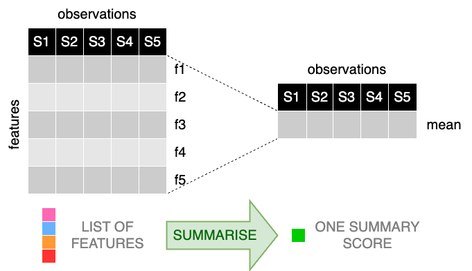

<!-- README.md is generated from README.Rmd. Please edit the README.Rmd file -->
<!-- # ```{r, include = FALSE} -->
<!-- # knitr::opts_chunk$set( -->
<!-- #   collapse = TRUE, -->
<!-- #   comment = "#>", -->
<!-- #   # fig.path = "man/figures/README-", -->
<!-- #   fig.path = "articles/figures/", -->
<!-- #   # fig.path = "vignettes/figures/", -->
<!-- #   # fig.path = "man/figures/", -->
<!-- #   out.width = "100%" -->
<!-- # ) -->
<!-- # ``` -->

# sigscores

**sigscores** is an R package providing ready-to-use functions to
compute summary scores.

The idea behind **sigscores** is to provide in a single R package
different summary scores allowing for an easy computation and comparison
of the metrics.



Different strategies are currently supported, including the common mean,
median, and mode scores.

<!-- badges: start -->
<!-- badges: end -->

## Installation

You can install latest development version from GitHub (requires
[devtools](https://github.com/hadley/devtools) package):

``` r
if (!require("devtools")) {
  install.packages("devtools")
}

devtools::install_github(
  repo = "alebarberis/sigscores", 
  dependencies = TRUE, 
  build_vignettes = FALSE
)
```

## Getting started

If you are just getting started with **sigscores**, we recommend looking
at the [Getting Started](articles/sigscores.html) section of the site.

## Credits

**sigscores** was conceived, developed, and is maintained by Dr
Alessandro Barberis ([@alebarberis](https://github.com/alebarberis)).

## Acknowledgment

I would like to express my sincere gratitude to [Prostate Cancer
UK](https://prostatecanceruk.org/) for their generous funding, which
made it possible for me to develop the first version of this package.
